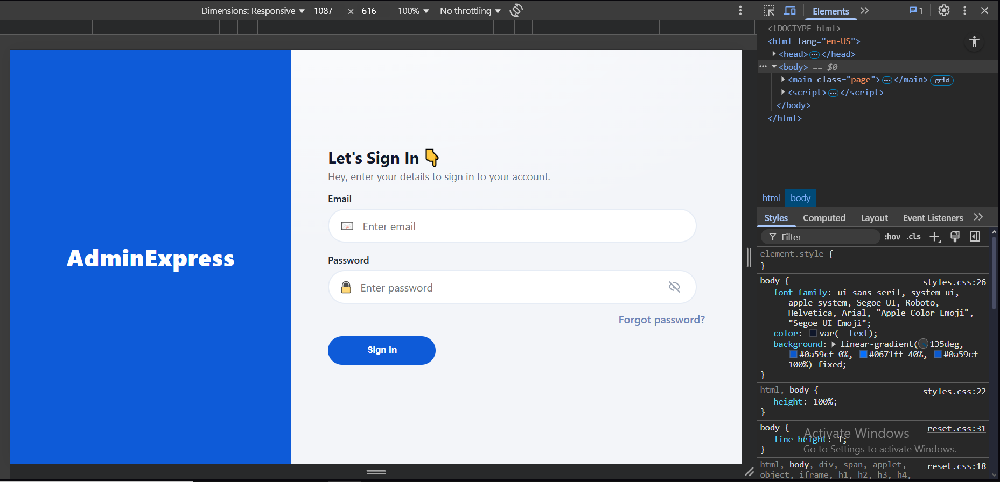
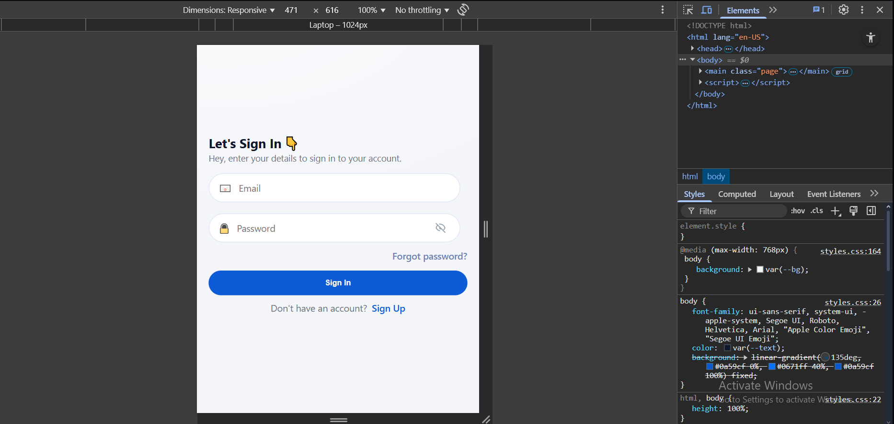

## AdminExpress - Responsive Sign In (HTML + CSS)

This is a simple, clean replication of the AdminExpress sign-in design using only HTML and CSS (Grid, Flexbox, and Media Queries). The layout adapts to desktop, tablet, and mobile viewports.

### What was built
- Two-panel layout: left brand panel, right sign-in content.
- Accessible sign-in form with email and password fields, including a show/hide password eye icon.
- “Forgot password?” helper aligned per design.
- Mobile-only footer: “Don’t have an account? Sign Up”.
- Mobile-specific tweaks: hide left brand panel, hide field titles, and simplify placeholders to “Email” and “Password”.

### Techniques used
- CSS Grid for the overall page layout (left/right panels).
- Flexbox for input rows (icon + input + eye button) and small alignment pieces.
- Media Queries to adapt spacing, columns, visibility, and content between desktop and mobile.
- CSS custom properties for colors, spacing, and consistency.

### Files
- `index.html`: Semantic structure and minimal inline script to toggle password visibility and mobile placeholders.
- `css/reset.css`: Reset stylesheet.
- `css/styles.css`: All styling (Grid, Flexbox, variables, media queries).

### How responsiveness works
- Desktop: two equal columns; form content aligned to the left of the right column.
- Tablet/Mobile (≤768px): single column; left panel hidden; inputs full-width; mobile footer shown; labels hidden and placeholders simplified.
- On mobile the page background switches to the gray app background to match the reference and remove any blue bar at the bottom.

### References
- CSS Grid guide (concepts and properties): https://css-tricks.com/snippets/css/complete-guide-grid
- Flexbox guide (rows, alignment, spacing): https://css-tricks.com/snippets/css/a-guide-to-flexbox

### How to run
Open `index.html` in your browser. No build tools or dependencies are required.

### Screens

#### Desktop

  

#### Mobile

  

### Author & License

- Author: Justin Gomezcoello
- License: MIT (feel free to use and modify)